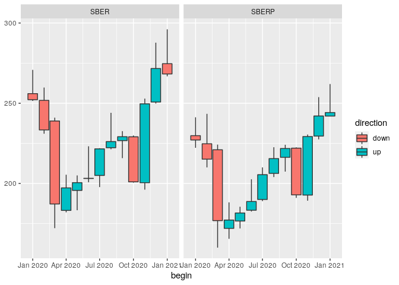

<!-- README.md is generated from README.Rmd. Please edit that file -->

# moexer

<!-- badges: start -->
<!-- badges: end -->

Moscow Exchange (MOEX) provides a REST interface to its Informational
and Statistical Server (ISS), see <https://fs.moex.com/files/8888>.

`moexer` is a thin wrapper around the REST interface. It allows to
quickly fetch e.g. price candles for a particular security, obtain its
profile information and so on. The data is returned as `tibble`s, making
it easy to subsequently process and analyse it.

## Installation

You can install the released version of moexer from
[CRAN](https://CRAN.R-project.org) with:

``` r
install.packages("moexer")
```

or the latest version from github:

``` r
devtools::install_github("x1o/moexer")
```

## High-Level Interface to ISS

Suppose you want to download monthly candles from Jan 1, 2020 until the
present day for the Sberbank common shares.

``` r
library(moexer)
library(dplyr)
library(purrr)
```

Each security on MOEX has an ID, e.g. a 4-letter ticker symbol for a
share (“`LKOH`”) or an ISIN for a bond (“`RU000A0JXPU3`”).

Find the corresponding security ID:

``` r
search_security(query = 'Sberbank') |> 
    slice_head(n = 10) |> 
    select(secid, name, is_traded, type, primary_boardid)
```

<div class="kable-table">

| secid        | name                     | is_traded | type            | primary_boardid |
|:-------------|:-------------------------|----------:|:----------------|:----------------|
| SBER         | Сбербанк России ПАО ао   |         1 | common_share    | TQBR            |
| SBERP        | Сбербанк России ПАО ап   |         1 | preferred_share | TQBR            |
| RU000A103WV8 | Сбербанк ПАО 001Р-SBER33 |         1 | exchange_bond   | TQCB            |
| RU000A105SD9 | Сбербанк ПАО 001Р-SBER42 |         1 | exchange_bond   | TQCB            |
| RU000A101QW2 | Сбербанк ПАО 001Р-SBER16 |         1 | exchange_bond   | TQCB            |
| RU000A1069P3 | Сбербанк ПАО 002Р-SBER44 |         1 | exchange_bond   | TQCB            |
| RU000A103661 | Сбербанк ПАО 001Р-SBER27 |         1 | exchange_bond   | TQCB            |
| RU000A103KG4 | Сбербанк ПАО 001Р-SBERD1 |         1 | exchange_bond   | TQCB            |
| RU000A103G42 | Сбербанк ПАО 001Р-SBER29 |         1 | exchange_bond   | TQCB            |
| RU000A102YG7 | Сбербанк ПАО 001Р-SBER25 |         1 | exchange_bond   | TQCB            |

</div>

We can verify that `SBER` is indeed the symbol we were looking for and
check the profile information:

``` r
sber_info <- get_security_info(secid = 'SBER')
sber_info$description |> 
    select(name, title, value)
```

<div class="kable-table">

| name                 | title                                            | value                  |
|:---------------------|:-------------------------------------------------|:-----------------------|
| SECID                | Код ценной бумаги                                | SBER                   |
| NAME                 | Полное наименование                              | Сбербанк России ПАО ао |
| SHORTNAME            | Краткое наименование                             | Сбербанк               |
| ISIN                 | ISIN код                                         | RU0009029540           |
| REGNUMBER            | Номер государственной регистрации                | 10301481B              |
| ISSUESIZE            | Объем выпуска                                    | 21586948000            |
| FACEVALUE            | Номинальная стоимость                            | 3                      |
| FACEUNIT             | Валюта номинала                                  | SUR                    |
| ISSUEDATE            | Дата начала торгов                               | 2007-07-20             |
| LATNAME              | Английское наименование                          | Sberbank               |
| LISTLEVEL            | Уровень листинга                                 | 1                      |
| ISQUALIFIEDINVESTORS | Бумаги для квалифицированных инвесторов          | 0                      |
| MORNINGSESSION       | Допуск к утренней дополнительной торговой сессии | 1                      |
| EVENINGSESSION       | Допуск к вечерней дополнительной торговой сессии | 1                      |
| TYPENAME             | Вид/категория ценной бумаги                      | Акция обыкновенная     |
| GROUP                | Код типа инструмента                             | stock_shares           |
| TYPE                 | Тип бумаги                                       | common_share           |
| GROUPNAME            | Типа инструмента                                 | Акции                  |
| EMITTER_ID           | Код эмитента                                     | 1199                   |

</div>

``` r
sber_info$boards |> 
    slice_head(n = 10) |> 
    select(secid, boardid, title, is_traded, history_from, history_till, currencyid)
```

<div class="kable-table">

| secid | boardid | title                                      | is_traded | history_from | history_till | currencyid |
|:------|:--------|:-------------------------------------------|----------:|:-------------|:-------------|:-----------|
| SBER  | TQBR    | Т+: Акции и ДР - безадрес.                 |         1 | 2013-03-25   | 2024-03-07   | RUB        |
| SBER  | EQBR    | Основной режим: А1-Акции и паи - безадрес. |         0 | 2011-11-21   | 2013-08-30   | RUB        |
| SBER  | SPEQ    | Поставка по СК (акции)                     |         1 | 2018-06-29   | 2023-12-22   | RUB        |
| SBER  | SMAL    | Т+: Неполные лоты (акции) - безадрес.      |         1 | 2011-11-21   | 2024-03-07   | RUB        |
| SBER  | TQDP    | Крупные пакеты - Акции - безадрес.         |         0 | NA           | NA           | RUB        |
| SBER  | EQDP    | Крупные пакеты - Акции - безадрес.         |         0 | 2011-12-12   | 2019-03-01   | RUB        |
| SBER  | RPMO    | РЕПО-М - адрес.                            |         1 | 2019-04-22   | 2024-03-07   | RUB        |
| SBER  | PTEQ    | РПС с ЦК: Акции и ДР - адрес.              |         1 | 2013-03-26   | 2024-03-07   | RUB        |
| SBER  | MXBD    | MOEX Board                                 |         0 | 2015-08-03   | 2024-03-08   | NA         |
| SBER  | CLMR    | Classica - безадрес.                       |         0 | 2012-02-13   | 2015-07-31   | RUB        |

</div>

Fetch the `SBER` candles:

``` r
get_candles(secid = 'SBER', from = '2020-01-01', till = '2022-01-01', interval = 'monthly') |> 
    head()
```

<div class="kable-table">

| secid |   open |  close |   high |    low |        value |     volume | begin      | end        |
|:------|-------:|-------:|-------:|-------:|-------------:|-----------:|:-----------|:-----------|
| SBER  | 255.99 | 252.20 | 270.80 | 251.40 | 194032391970 |  747137520 | 2020-01-01 | 2020-01-31 |
| SBER  | 251.80 | 233.36 | 259.77 | 231.00 | 229515686975 |  919822790 | 2020-02-01 | 2020-02-28 |
| SBER  | 238.93 | 187.21 | 241.00 | 172.15 | 585178686681 | 3001736660 | 2020-03-01 | 2020-03-31 |
| SBER  | 183.20 | 197.25 | 205.44 | 182.00 | 339626472208 | 1768222700 | 2020-04-01 | 2020-04-30 |
| SBER  | 195.68 | 200.50 | 205.00 | 183.33 | 262827471698 | 1359045230 | 2020-05-01 | 2020-05-29 |
| SBER  | 203.10 | 203.22 | 223.15 | 200.75 | 320424161576 | 1522268370 | 2020-06-01 | 2020-06-30 |

</div>

`get_candles()` also supports specifying date-times for the `from`,
`till` arguments, e.g. `'2020-01-01 09:00:00'`. This is most useful for
obtaining intraday candles, e.g with `interval = 'hourly'` — see
`options('moexer.candle.intervals')`.

If `till = NULL`, all candles up to today are fetched.

`get_candles()` is vectorised over `secid`, so it is possible to, say,
fetch candles for both the common and the preferred shares. The returned
object has class `MoexCandles` for which there’s an appropriate `plot()`
method:

``` r
get_candles(
    secid = c('SBER', 'SBERP'), 
    from = '2020-01-01', 
    till = '2022-01-01', 
    interval = 'monthly'
) |> 
    plot()
```

<!-- -->

## Low-level Interface to ISS

### Request

ISS is accessed via HTTP and/or HTTPS.

The interface is “RESTful”, meaning the endpoint parameters can be
passed as a query string, but they form the path of the URL. For
instance, to receive `SBER` candles, one would need to form a URL as
below:

    <base_url>/securities/SBER/candles?from=2020-01-10&till=2020-01-17

For a list of all public endpoints, see
<http://iss.moex.com/iss/reference/>.

### Response

ISS is capable of return data in several formats; the present package
uses JSON internally.

Every response consists of named sections (“blocks”).

Every block contains the following sub-sections:

- `metadata` with types
- `column` with column names
- `data` with the actual payload

All response blocks are parsed as tibbles using the information above.

### Query String Parameters

The parameters can be applied to some sections (1), all section (2) or
modify “system” ISS parameters (3).

1.  `<block>.<parameter>`=`<value>` (applicable for block `<block>`)
    - `<block>.columns`=`<id_1>,<id_2>,...`: only select these column in
      the block `<block>`
2.  `<parameter>`=`<value>` (all response blocks)
3.  `iss.<parameter>`=`<value>` (system parameter)
    - `iss.only`=`<block_1>,<block_2>,...`: only return these blocks

### Examples

The main function for working with low-level requests is `query_iss()`.

#### Simple Queries

Fetch possible values for certain market objects. This returns a list of
sections such as `engines`, `markets`, etc, each being a dataframe.

``` r
iss_index <- query_iss('index')
names(iss_index)
#>  [1] "engines"             "markets"             "boards"             
#>  [4] "boardgroups"         "durations"           "securitytypes"      
#>  [7] "securitygroups"      "securitycollections"
```

``` r
iss_index$engines
```

<div class="kable-table">

|   id | name          | title                            |
|-----:|:--------------|:---------------------------------|
|    1 | stock         | Фондовый рынок и рынок депозитов |
|    2 | state         | Рынок ГЦБ (размещение)           |
|    3 | currency      | Валютный рынок                   |
|    4 | futures       | Срочный рынок                    |
|    5 | commodity     | Товарный рынок                   |
|    6 | interventions | Товарные интервенции             |
|    7 | offboard      | ОТС-система                      |
|    9 | agro          | Агро                             |
| 1012 | otc           | ОТС с ЦК                         |
| 1282 | quotes        | Квоты                            |

</div>

Query string parameters are specified as `params` argument;
`debug_output = TRUE` results in the request URL being printed:

``` r
df <- query_iss(
    'index',
    params = list(
        iss.only = 'engines,markets', 
        markets.columns = 'id,market_name,market_title'
    ),
    debug_output = TRUE
)
#>  http://iss.moex.com/iss/index.json?iss.only=engines,markets&markets.columns=id,market_name,market_title
df$engines |> head()
```

<div class="kable-table">

|  id | name          | title                            |
|----:|:--------------|:---------------------------------|
|   1 | stock         | Фондовый рынок и рынок депозитов |
|   2 | state         | Рынок ГЦБ (размещение)           |
|   3 | currency      | Валютный рынок                   |
|   4 | futures       | Срочный рынок                    |
|   5 | commodity     | Товарный рынок                   |
|   6 | interventions | Товарные интервенции             |

</div>

``` r
df$markets |> head()
```

<div class="kable-table">

|  id | market_name | market_title              |
|----:|:------------|:--------------------------|
|   5 | index       | Индексы фондового рынка   |
|   1 | shares      | Рынок акций               |
|   2 | bonds       | Рынок облигаций           |
|   4 | ndm         | Режим переговорных сделок |
|  29 | otc         | ОТС                       |
|  27 | ccp         | РЕПО с ЦК                 |

</div>

``` r
show_df <- function(df) {
    print(nrow(df))
    bind_rows(head(df), tail(df))
}
```

#### Queries Involving Cursor

Some queries return large responses, which are split into pages that
must accessed using `start` query string parameter as indicated in the
auxiliary section `history.cursor`, also returned by ISS:

``` r
df <- query_iss(
    'history/engines/stock/markets/shares/securities/MOEX',
    params = list(
        from = '2021-09-01',
        till = '2021-12-31',
        start = 10
    )
)
show_df(df$history[,1:10])
#>  [1] 100
```

<div class="kable-table">

| BOARDID | TRADEDATE  | SHORTNAME | SECID | NUMTRADES |        VALUE |   OPEN |    LOW |   HIGH | LEGALCLOSEPRICE |
|:--------|:-----------|:----------|:------|----------:|-------------:|-------:|-------:|-------:|----------------:|
| SMAL    | 2021-09-08 | МосБиржа  | MOEX  |        16 | 3.869140e+03 | 184.91 | 183.00 | 186.00 |              NA |
| TQBR    | 2021-09-08 | МосБиржа  | MOEX  |     20040 | 1.331147e+09 | 187.00 | 181.30 | 187.83 |          182.88 |
| SMAL    | 2021-09-09 | МосБиржа  | MOEX  |        22 | 5.684990e+03 | 182.50 | 182.00 | 184.49 |              NA |
| TQBR    | 2021-09-09 | МосБиржа  | MOEX  |     21268 | 1.162550e+09 | 182.95 | 181.02 | 184.88 |          183.18 |
| SMAL    | 2021-09-10 | МосБиржа  | MOEX  |        22 | 4.622800e+03 | 182.35 | 182.35 | 187.40 |              NA |
| TQBR    | 2021-09-10 | МосБиржа  | MOEX  |     17626 | 1.390805e+09 | 182.84 | 182.58 | 187.78 |          184.90 |
| TQBR    | 2021-11-12 | МосБиржа  | MOEX  |     22104 | 1.369847e+09 | 171.49 | 168.01 | 171.66 |          169.73 |
| SMAL    | 2021-11-15 | МосБиржа  | MOEX  |        11 | 3.743810e+03 | 158.08 | 158.08 | 172.70 |              NA |
| TQBR    | 2021-11-15 | МосБиржа  | MOEX  |     20860 | 1.276717e+09 | 169.27 | 168.82 | 173.70 |          171.69 |
| SMAL    | 2021-11-16 | МосБиржа  | MOEX  |        10 | 3.443480e+03 | 172.90 | 168.80 | 173.97 |              NA |
| TQBR    | 2021-11-16 | МосБиржа  | MOEX  |     23585 | 1.410013e+09 | 172.18 | 168.22 | 173.09 |          168.58 |
| SMAL    | 2021-11-17 | МосБиржа  | MOEX  |         9 | 2.547600e+03 | 168.51 | 168.49 | 172.39 |              NA |

</div>

``` r
df$history.cursor
```

<div class="kable-table">

| INDEX | TOTAL | PAGESIZE |
|------:|------:|---------:|
|    10 |   174 |      100 |

</div>

An adverb `following_cursor()` decorates `query_iss()` to follow the
cursor until the requested information is received completely. The
`.cursor` dataframe is dropped.

``` r
following_cursor(query_iss)(
    'history/engines/stock/markets/shares/securities/MOEX',
    params = list(
        from = '2021-09-01',
        till = '2021-12-31',
        start = 10
    )
) |> 
    pluck('history') |> 
    select(1:10) |> 
    show_df()
#>  [1] 164
```

<div class="kable-table">

| BOARDID | TRADEDATE  | SHORTNAME | SECID | NUMTRADES |        VALUE |   OPEN |    LOW |   HIGH | LEGALCLOSEPRICE |
|:--------|:-----------|:----------|:------|----------:|-------------:|-------:|-------:|-------:|----------------:|
| SMAL    | 2021-09-08 | МосБиржа  | MOEX  |        16 | 3.869140e+03 | 184.91 | 183.00 | 186.00 |              NA |
| TQBR    | 2021-09-08 | МосБиржа  | MOEX  |     20040 | 1.331147e+09 | 187.00 | 181.30 | 187.83 |          182.88 |
| SMAL    | 2021-09-09 | МосБиржа  | MOEX  |        22 | 5.684990e+03 | 182.50 | 182.00 | 184.49 |              NA |
| TQBR    | 2021-09-09 | МосБиржа  | MOEX  |     21268 | 1.162550e+09 | 182.95 | 181.02 | 184.88 |          183.18 |
| SMAL    | 2021-09-10 | МосБиржа  | MOEX  |        22 | 4.622800e+03 | 182.35 | 182.35 | 187.40 |              NA |
| TQBR    | 2021-09-10 | МосБиржа  | MOEX  |     17626 | 1.390805e+09 | 182.84 | 182.58 | 187.78 |          184.90 |
| SMAL    | 2021-12-28 | МосБиржа  | MOEX  |         3 | 9.473100e+02 | 159.90 | 150.13 | 159.90 |              NA |
| TQBR    | 2021-12-28 | МосБиржа  | MOEX  |     19040 | 1.097535e+09 | 152.15 | 151.27 | 153.34 |          152.38 |
| SMAL    | 2021-12-29 | МосБиржа  | MOEX  |        14 | 3.190540e+03 | 154.86 | 143.02 | 156.98 |              NA |
| TQBR    | 2021-12-29 | МосБиржа  | MOEX  |     15518 | 8.011846e+08 | 151.84 | 150.80 | 152.59 |          152.10 |
| SMAL    | 2021-12-30 | МосБиржа  | MOEX  |        11 | 2.600790e+03 | 153.01 | 145.79 | 165.34 |              NA |
| TQBR    | 2021-12-30 | МосБиржа  | MOEX  |     17425 | 8.129008e+08 | 152.57 | 152.10 | 153.67 |          153.18 |

</div>

#### Queries With Automatical `start` Increment

Some responses are large yet are not accompanied by a `.cursor` block.

``` r
query_iss(
    'engines/stock/markets/shares/boards/TQBR/securities/SBER/candles',
    params = list(
        from = URLencode('2020-01-10 10:00:00'),
        till = URLencode('2020-01-10 23:59:59'),
        interval = 1,
        start = 10
    ),
    debug_output = TRUE
) |> 
    pluck('candles') |> 
    show_df()
#>  http://iss.moex.com/iss/engines/stock/markets/shares/boards/TQBR/securities/SBER/candles.json?from=2020-01-10%2010:00:00&till=2020-01-10%2023:59:59&interval=1&start=10
#>  [1] 500
```

<div class="kable-table">

|   open |  close |   high |    low |    value | volume | begin               | end                 |
|-------:|-------:|-------:|-------:|---------:|-------:|:--------------------|:--------------------|
| 257.00 | 257.30 | 257.39 | 256.90 | 30515548 | 118660 | 2020-01-10 10:10:00 | 2020-01-10 10:10:59 |
| 257.24 | 257.32 | 257.38 | 257.20 | 14548053 |  56550 | 2020-01-10 10:11:00 | 2020-01-10 10:11:59 |
| 257.30 | 257.37 | 257.38 | 257.16 |  5638369 |  21920 | 2020-01-10 10:12:00 | 2020-01-10 10:12:59 |
| 257.28 | 257.30 | 257.47 | 257.23 |  4317722 |  16780 | 2020-01-10 10:13:00 | 2020-01-10 10:13:59 |
| 257.30 | 257.44 | 257.44 | 257.30 |  8505667 |  33050 | 2020-01-10 10:14:00 | 2020-01-10 10:14:59 |
| 257.43 | 257.32 | 257.43 | 257.20 | 12989804 |  50490 | 2020-01-10 10:15:00 | 2020-01-10 10:15:59 |
| 257.86 | 257.85 | 257.87 | 257.80 |  3640487 |  14120 | 2020-01-10 18:24:00 | 2020-01-10 18:24:59 |
| 257.84 | 257.85 | 257.97 | 257.80 | 19307540 |  74860 | 2020-01-10 18:25:00 | 2020-01-10 18:25:59 |
| 257.84 | 257.70 | 257.84 | 257.70 |  5734978 |  22250 | 2020-01-10 18:26:00 | 2020-01-10 18:26:59 |
| 257.71 | 257.71 | 257.82 | 257.70 |  8255241 |  32030 | 2020-01-10 18:27:00 | 2020-01-10 18:27:59 |
| 257.77 | 257.82 | 257.83 | 257.71 |  9292759 |  36050 | 2020-01-10 18:28:00 | 2020-01-10 18:28:59 |
| 257.80 | 257.90 | 257.97 | 257.75 | 21327564 |  82730 | 2020-01-10 18:29:00 | 2020-01-10 18:29:59 |

</div>

These queries may accessed by `query_iss()` wrapped into
`fetching_fully` decorator, which automatically increases the value of
`start` parameter until no more data is received:

``` r
fetching_fully(query_iss)(
    'engines/stock/markets/shares/boards/TQBR/securities/SBER/candles',
    params = list(
       from = URLencode('2020-01-10 10:00:00'),
       till = URLencode('2020-01-10 23:59:59'),
       interval = 1,
       start = 10
    )
) |> 
    pluck('candles') |> 
    show_df()
#>  [1] 515
```

<div class="kable-table">

|   open |  close |   high |    low |     value |  volume | begin               | end                 |
|-------:|-------:|-------:|-------:|----------:|--------:|:--------------------|:--------------------|
| 257.00 | 257.30 | 257.39 | 256.90 |  30515548 |  118660 | 2020-01-10 10:10:00 | 2020-01-10 10:10:59 |
| 257.24 | 257.32 | 257.38 | 257.20 |  14548053 |   56550 | 2020-01-10 10:11:00 | 2020-01-10 10:11:59 |
| 257.30 | 257.37 | 257.38 | 257.16 |   5638369 |   21920 | 2020-01-10 10:12:00 | 2020-01-10 10:12:59 |
| 257.28 | 257.30 | 257.47 | 257.23 |   4317722 |   16780 | 2020-01-10 10:13:00 | 2020-01-10 10:13:59 |
| 257.30 | 257.44 | 257.44 | 257.30 |   8505667 |   33050 | 2020-01-10 10:14:00 | 2020-01-10 10:14:59 |
| 257.43 | 257.32 | 257.43 | 257.20 |  12989804 |   50490 | 2020-01-10 10:15:00 | 2020-01-10 10:15:59 |
| 257.81 | 257.81 | 257.85 | 257.80 |  17768959 |   68920 | 2020-01-10 18:39:00 | 2020-01-10 18:39:59 |
| 258.19 | 258.19 | 258.19 | 258.19 | 328812711 | 1273530 | 2020-01-10 18:45:00 | 2020-01-10 18:45:59 |
| 258.19 | 258.19 | 258.19 | 258.19 |   3268685 |   12660 | 2020-01-10 18:46:00 | 2020-01-10 18:46:59 |
| 258.19 | 258.19 | 258.19 | 258.19 |    206552 |     800 | 2020-01-10 18:47:00 | 2020-01-10 18:47:59 |
| 258.19 | 258.19 | 258.19 | 258.19 |    258190 |    1000 | 2020-01-10 18:48:00 | 2020-01-10 18:48:59 |
| 258.19 | 258.19 | 258.19 | 258.19 |  25899039 |  100310 | 2020-01-10 18:49:00 | 2020-01-10 18:49:59 |

</div>

Some endpoints do not support `start` parameter – `fetching_fully()`
knows how to handle that:

``` r
fetching_fully(query_iss)('turnovers', params = list(iss.only = 'turnovers'))$turnovers
#>  ! Received identical sections: the endpoint probably does not support `start` parameter
```

<div class="kable-table">

| NAME      |   ID |     VALTODAY | VALTODAY_USD | NUMTRADES | UPDATETIME          | TITLE                            |
|:----------|-----:|-------------:|-------------:|----------:|:--------------------|:---------------------------------|
| stock     |    1 | 2401088.7616 | 26458.482452 |   1926375 | 2024-03-11 12:48:05 | Фондовый рынок и рынок депозитов |
| currency  |    3 |  966523.2345 | 10650.475921 |     85552 | 2024-03-11 12:48:05 | Валютный рынок                   |
| futures   |    4 |  163009.5623 |  1796.262476 |    532807 | 2024-03-11 12:48:05 | Срочный рынок                    |
| commodity |    5 |           NA |           NA |        NA | 2024-03-11 07:00:00 | Товарный рынок                   |
| agro      |    9 |     168.6662 |     1.858595 |        32 | 2024-03-11 12:40:22 | Агро                             |
| otc       | 1012 |    1059.1171 |    11.670802 |      2326 | 2024-03-11 12:47:56 | ОТС с ЦК                         |
| quotes    | 1282 |           NA |           NA |        NA | 2024-03-11 09:30:01 | Квоты                            |
| TOTALS    |   NA | 3531849.3417 | 38918.750246 |   2547092 | 2024-03-11 12:48:05 | Всего по Московской Бирже        |

</div>
